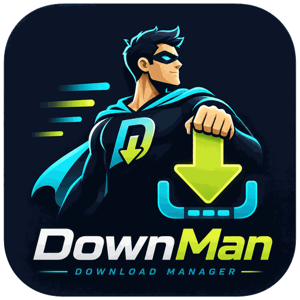
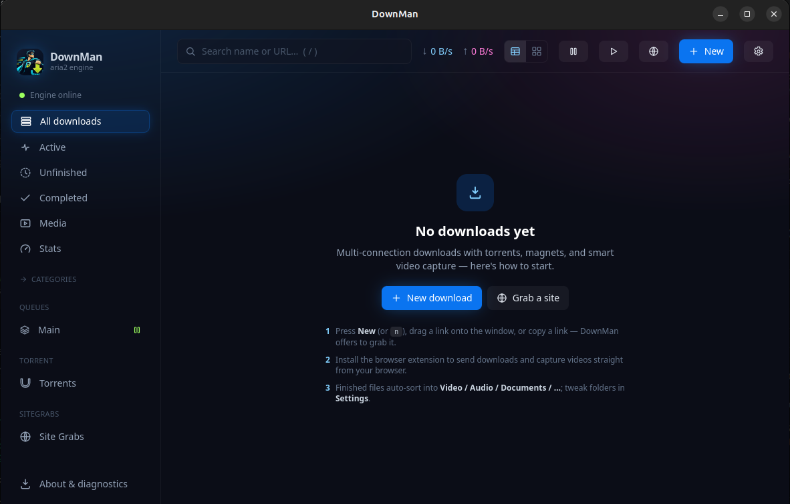
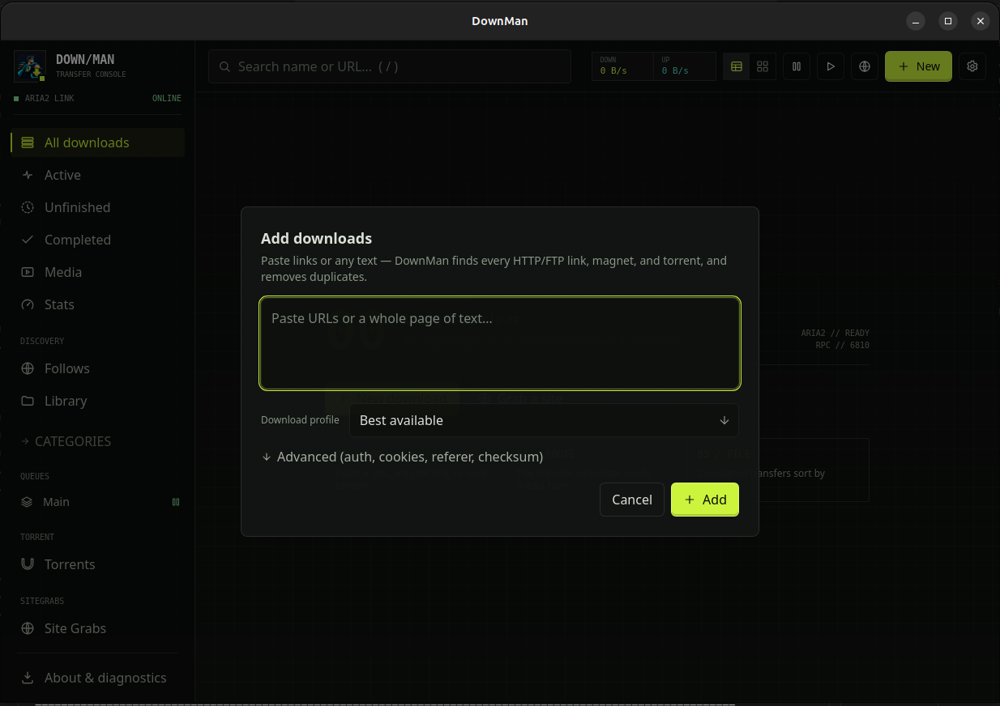
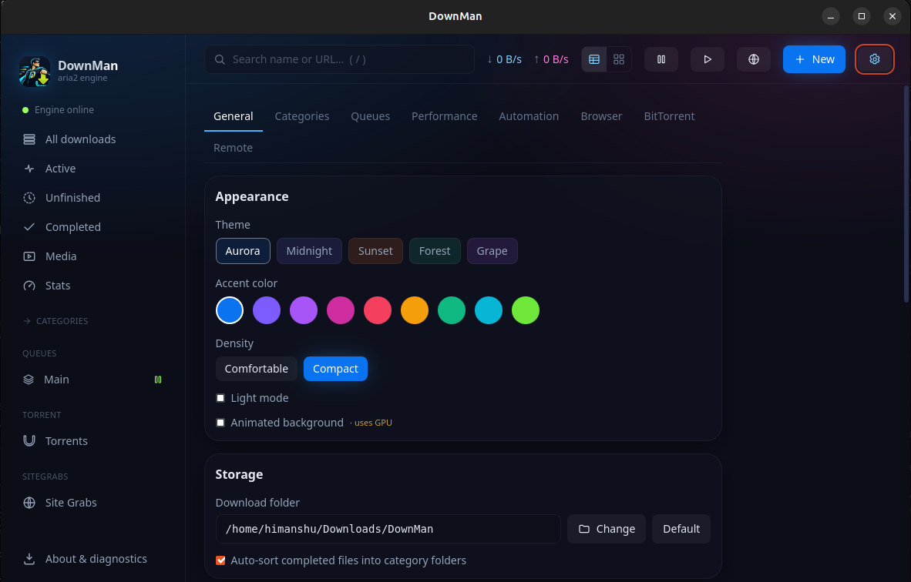

<p align="center">
  
</p>

A modern, low‑footprint **download manager for Linux**, built on the
[aria2](https://aria2.github.io/) engine — a fast, click‑to‑grab download experience with a custom UI,
torrent/magnet support, smart media capture, and companion browser extensions.

> Personal project. Target platform: Ubuntu 26.04 / GNOME 50 (x86_64).
>
> **Note:** Built with heavy use of AI coding agents — architecture, feature decisions, testing, and review are human (mine).

---

## Install (the easy way)

Just want to use DownMan? Here's the simplest way to install it on **Ubuntu** (or any
Debian‑based Linux) with the `.deb` package — no Linux experience needed.

1. **Download** the latest `downman_…_amd64.deb` from the
   [**Releases**](https://github.com/rai-himanshu07/DownMan/releases) page.
2. **Open the folder** you saved it in (usually **Downloads**), right‑click an empty
   spot, and choose **"Open Terminal Here."**
3. **Copy‑paste this one line** and press <kbd>Enter</kbd>. When it asks for your password,
   type it (it stays invisible as you type — that's normal) and press <kbd>Enter</kbd> again:
   ```bash
   sudo apt install ./downman_*_amd64.deb
   ```
4. **Launch DownMan** — open *Activities* / the app grid and search for **"DownMan."**

That's it! The installer automatically pulls in the two helper tools DownMan needs
(`aria2` and `ffmpeg`), so there's nothing else to set up.

> **Tip:** You can also just **double‑click** the `.deb` file to open it in your software
> installer and press **Install**. If no Install button appears (some Ubuntu versions can't
> install local `.deb` files this way), use the one‑line command above instead.

**Update** later by downloading the newer `.deb` and running the same command.
**Uninstall** any time with `sudo apt remove downman`.

---

## Screenshots

<p align="center">
  
</p>
<p align="center">
  
  &nbsp;
  
</p>

---

## Highlights

- **aria2 engine** — HTTP/FTP, **torrent**, **magnet**, multi‑connection (16 splits/server).
- **Custom UI** — Tauri 2 + React; dark/light "aurora" design system, ~200–250 MB RAM (system WebView, no Chromium bundle).
- **Smart media capture** — extension sniffs streams in the background and surfaces a single
  on‑demand pill (no per‑thumbnail clutter). HLS/DASH are merged to `.mp4` via ffmpeg.
- **Site video capture** — page URLs from 1800+ sites are resolved by **yt‑dlp**
  with a quality picker (best/1080p/720p/audio) and optional browser cookies. DRM sites are not supported.
- **Auto‑organization** — completed files sorted into `Video / Audio / Images / Documents / Archives / Other`.
- **Browser bridge** — Chromium + Firefox MV3 extensions talk to the app over a local HTTP endpoint.
- **Queue control** — pause/resume per item, pause‑all/resume‑all, global speed cap.
- **Integrity & mirrors** — checksum verification (MD5 / SHA‑1 / SHA‑256 / SHA‑512), automatically
  after completion or on demand; multi‑source and **Metalink** downloads; `SHA256SUMS` for releases.
- **Duplicate detection** — re‑adding a URL already in the list prompts *Skip / Add anyway*.
- **Per‑download actions** — pick an on‑complete action (open file · reveal folder · run a command)
  for an individual download, overriding the global default.
- **Light & dark themes** — variable‑driven; toggle in *Settings → Appearance*, with accent presets
  and a compact density.

---

## Quick start (development)

```bash
npm install          # frontend + Tauri CLI
npm run app          # tauri dev — launches the window, starts aria2 + bridge
```

The app writes downloads to `~/Downloads/DownMan/`.

## Build a package

```bash
npm run app:build -- --bundles deb appimage   # → src-tauri/target/release/bundle/{deb,appimage}/

# .deb — pulls in aria2 + ffmpeg automatically:
sudo apt install ./src-tauri/target/release/bundle/deb/downman_0.1.2_amd64.deb

# AppImage — portable, but install its two runtime tools yourself first:
sudo apt install aria2 ffmpeg
chmod +x ./src-tauri/target/release/bundle/appimage/downman_0.1.2_amd64.AppImage
./src-tauri/target/release/bundle/appimage/downman_0.1.2_amd64.AppImage
```

> **AppImage note:** the AppImage bundles the app + the WebKit/GTK runtime, but **not** `aria2`/`ffmpeg`
> — DownMan launches those from `PATH`, so install both once via your package manager. The `.deb`
> handles this for you through its declared dependencies.

> Release checksums: `npm run release` builds the bundles then writes `SHA256SUMS`
> (or `npm run checksums` against an existing build); verify with `sha256sum -c SHA256SUMS`.

> Build profile note: release uses `lto = false`, `codegen-units = 16` on purpose.
> See [ADR‑0008](docs/adr/0008-release-build-profile.md) — LTO + 1 codegen unit hangs on the GTK/WebKit crates.

## Install the browser extension

- **Chromium** (Chrome/Brave/Edge): `chrome://extensions` → enable *Developer mode* → *Load unpacked* → select `extensions/`.
- **Firefox**: `about:debugging#/runtime/this-firefox` → *Load Temporary Add‑on* → select `extensions/manifest.json`.

The extension defaults to the app endpoint `http://127.0.0.1:6802` (configurable in its options page).

---

## Repository layout

```
DownMan/
├── index.html, vite.config.ts, tailwind.config.js   # frontend tooling
├── src/                     # React UI
│   ├── App.tsx, main.tsx, store.ts, index.css
│   ├── lib/                 # api (Tauri invoke wrappers) + formatters
│   └── components/          # Sidebar, TopBar, DownloadCard, AddModal, SettingsView, icons
├── src-tauri/               # Rust core
│   ├── src/lib.rs           # commands, engine spawn, HTTP bridge
│   ├── src/aria2.rs         # aria2 JSON-RPC client
│   ├── binaries/            # local build staging (gitignored); aria2/ffmpeg are runtime deps
│   └── tauri.conf.json, Cargo.toml, capabilities/
├── extensions/              # MV3 browser extension (Chromium + Firefox)
└── docs/                    # architecture + ADRs (this documentation)
```

## Documentation

- [Architecture overview](docs/ARCHITECTURE.md)
- [Architecture Decision Records](docs/adr/README.md)
- [Changelog](CHANGELOG.md)
- [Security policy](SECURITY.md)

## License

DownMan is released under the **[MIT License](LICENSE)** — free to use, modify, and distribute,
including in commercial products, provided *as is* with no warranty. Just keep the copyright and
license notice.

You remain solely responsible for how you use it — including compliance with the terms of service of any
site you access, the copyright and licensing of any content you download, and the laws of your
jurisdiction. DownMan does not circumvent DRM.

The tools DownMan runs as separate processes — **aria2** (GPL‑2.0‑or‑later), **FFmpeg** (LGPL/GPL),
**yt‑dlp** (Unlicense) — are not bundled. Attribution for the libraries compiled into DownMan's binaries
is in [`THIRD-PARTY-LICENSES.md`](THIRD-PARTY-LICENSES.md).

## Credits

Created and maintained by **Himanshu Rai** — [@rai‑himanshu07](https://github.com/rai-himanshu07).

DownMan stands on the shoulders of excellent open‑source projects; thank you to the maintainers of
[aria2](https://aria2.github.io/), [yt‑dlp](https://github.com/yt-dlp/yt-dlp),
[FFmpeg](https://ffmpeg.org/), and [Tauri](https://tauri.app/).
