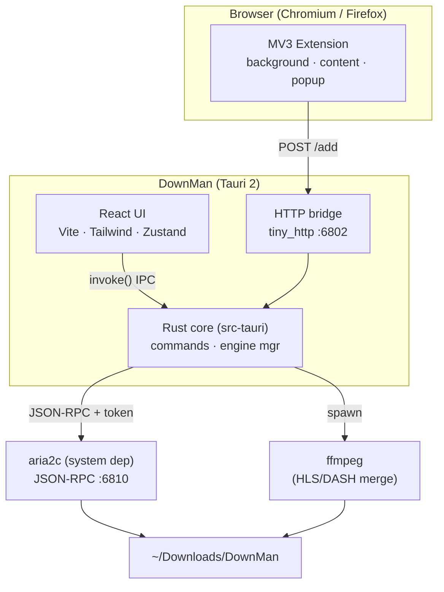
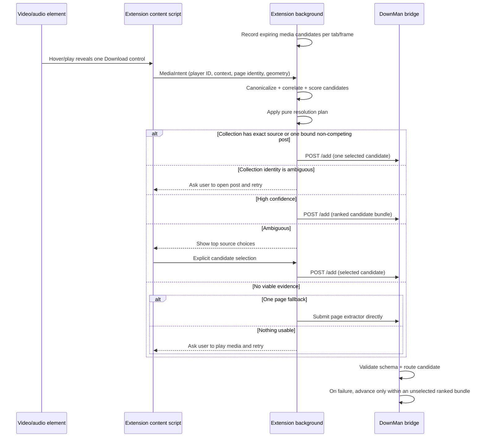

# Architecture

DownMan is a three‑layer system: a **React UI**, a **Rust core** (Tauri), and the
**aria2** download engine. Browser **extensions** feed downloads in through a local HTTP bridge.

## Component diagram

## Processes & ports

| Component        | Bind                | Auth                       | Purpose                                   |
| ---------------- | ------------------- | -------------------------- | ----------------------------------------- |
| aria2 JSON‑RPC   | `127.0.0.1:6810`    | random 32‑char secret token | download control (add/pause/status/stat)  |
| Extension bridge | `127.0.0.1:6802`    | loopback‑only; web‑page Origins refused | accept `POST /add` from the browser |
| Vite dev server  | `localhost:1420`    | —                          | UI during `tauri dev` only                |

`aria2c` is launched with `--rpc-listen-all=false`, so RPC is reachable only from localhost.
The RPC secret is generated per app launch and never leaves the process.

## Data flow

### Adding a download
1. **From UI** → `AddModal` → `invoke("add_download", { uris, options })` → Rust → `aria2.addUri`.
2. **From browser** → extension `POST http://127.0.0.1:6802/add` → bridge → `decide_route`
    picks the engine from URL, content-type, and DOM evidence (direct file → aria2; page/stream →
    yt‑dlp; HLS/DASH merged by ffmpeg). Media actions carry a ranked candidate bundle so a failed
    source can advance to the next candidate.

Ordinary browser-download interception is transaction-based: only newly-created in-progress items
are eligible; state persists across MV3 worker suspension; completed/history replay events are
ignored. The browser download is paused before handoff, canceled after DownMan accepts it, and
resumed if the bridge rejects the request.

Browser-local `blob:` downloads cannot be fetched by aria2. For those, the extension lets Chrome
finish, then asks the local bridge to adopt the completed path. Rust accepts only canonical regular
files below the user's Downloads directory, moves the file into the configured category, records it
as completed, and the extension removes the obsolete Chrome history row.

### Live updates
The UI polls once per second: the Rust `snapshot` command aggregates
`aria2.tellActive` + `tellWaiting` + `tellStopped` + `getGlobalStat` and returns one payload.
Zustand stores it; cards re‑render with progress, speed, and ETA.
Each visible task carries an added timestamp; completed history also carries its completion time.

### Completion & organization
When a task reaches `complete`, the store calls `organize(gid)` once. Rust reads the file path via
`aria2.tellStatus`, then moves it into a category subfolder (rename, with copy fallback across mounts).

## Per-media downloads

The key UX rule is **one action on the media the user chose**. There is no separate stream pill,
badge, or global stream list. Passive network detection is correlated with a stable per-player ID,
frame, playback time, content type, response size, and visible geometry. Candidates expire, are
bounded per tab, and are stored in browser session storage so MV3 worker suspension does not erase
them. Partial byte-range media responses are excluded from download candidates; nearby semantic page
links are generic extractor evidence only when bound by direct ancestry or the nearest timestamp.
Concurrent players in one frame keep ambiguous streams unbound, and video intents reject known
audio-only manifests. If concurrent playback leaves no bound permalink or exact source, DownMan
fails safely with “Open post, retry” rather than selecting a neighboring stream. A shared URL
identity classifier collapses equivalent post and query-driven detail URLs
without host checks. Collection captures send only an exact HTTP element source or one canonical,
uniquely bound post with no visibly competing media; an extractor failure cannot fall through to
another feed manifest. Raw signed media URLs are retained for downloading; separately canonicalized
keys are used only to deduplicate those observations. Some sites also offer an explicit quality segment on the same control. See
[ADR‑0005](adr/0005-smart-media-capture.md) and [ADR‑0010](adr/0010-multi-engine-media-capture.md).

## Rust core surface (`src-tauri/src`)

- `lib.rs` — Tauri builder, plugin setup, `start_engine()` (spawns aria2c, self‑heals the port),
  `start_bridge()` (tiny_http), and commands.
- `aria2.rs` — typed JSON‑RPC client (`add_uri`, `pause`, `unpause`, `pause_all`, `unpause_all`,
  `remove`, `tell_active/waiting/stopped`, `tell_status`, `global_stat`, `change_global_option`).

**Commands exposed to the UI:** `add_download`, `pause`, `resume`, `pause_all`, `resume_all`,
`remove`, `snapshot`, `organize`, `grab_hls`, `set_global_option`, `engine_info`.

## Security notes

- RPC and bridge bind to loopback only; aria2 secret token is required on every RPC call.
- Bridge is loopback‑bound and **origin‑gated**: requests carrying a web‑page `Origin`
  (`http(s)://…` or `null`) are refused with `403`, so a website can't drive it; extension and native callers pass.
- No credentials are persisted; UI preferences live in `localStorage`.
