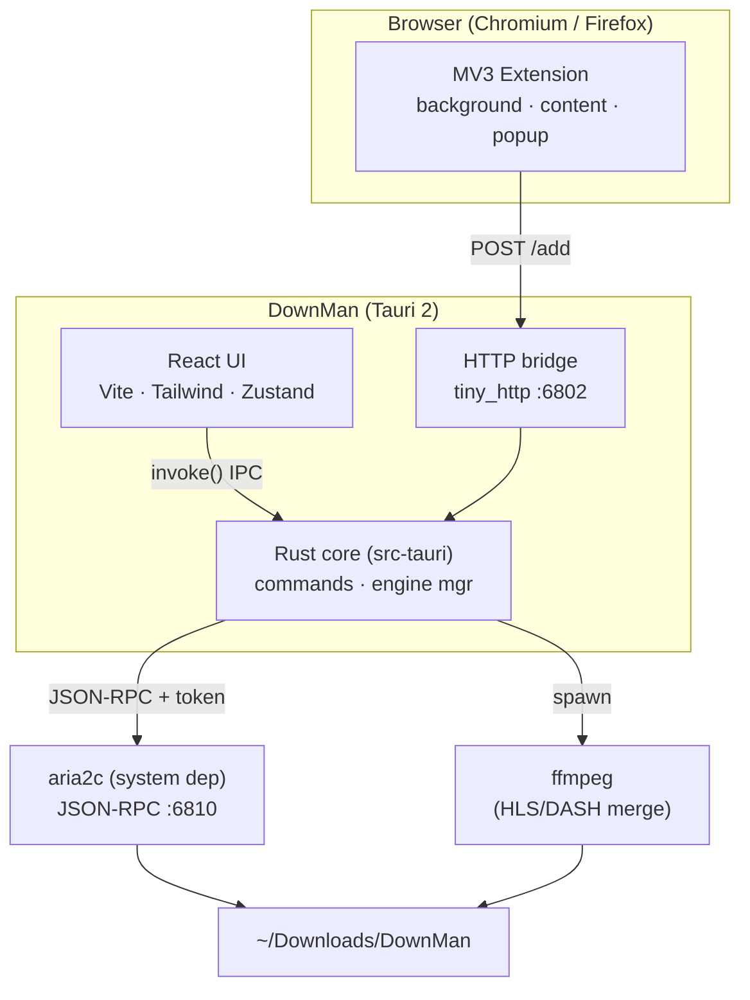
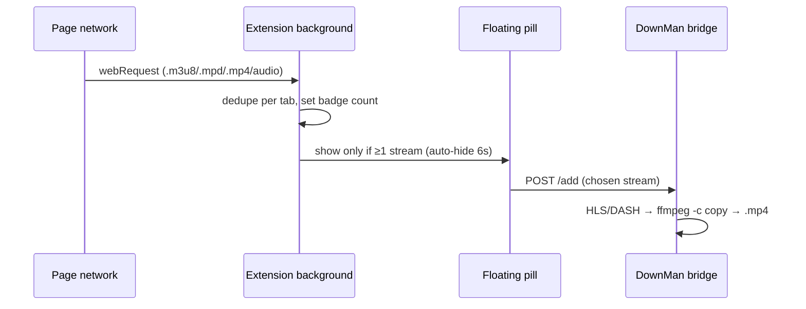

# Architecture

DownMan is a three‑layer system: a **React UI**, a **Rust core** (Tauri), and the
**aria2** download engine. Browser **extensions** feed downloads in through a local HTTP bridge.

## Component diagram

## Processes & ports

| Component        | Bind                | Auth                       | Purpose                                   |
| ---------------- | ------------------- | -------------------------- | ----------------------------------------- |
| aria2 JSON‑RPC   | `127.0.0.1:6810`    | random 32‑char secret token | download control (add/pause/status/stat)  |
| Extension bridge | `127.0.0.1:6802`    | loopback‑only; web‑page Origins refused | accept `POST /add` from the browser |
| Vite dev server  | `localhost:1420`    | —                          | UI during `tauri dev` only                |

`aria2c` is launched with `--rpc-listen-all=false`, so RPC is reachable only from localhost.
The RPC secret is generated per app launch and never leaves the process.

## Data flow

### Adding a download
1. **From UI** → `AddModal` → `invoke("add_download", { uris, options })` → Rust → `aria2.addUri`.
2. **From browser** → extension `POST http://127.0.0.1:6802/add` → bridge → `decide_route` picks the engine (direct file → aria2; page/stream → yt‑dlp; HLS/DASH merged by ffmpeg).

### Live updates
The UI polls once per second: the Rust `snapshot` command aggregates
`aria2.tellActive` + `tellWaiting` + `tellStopped` + `getGlobalStat` and returns one payload.
Zustand stores it; cards re‑render with progress, speed, and ETA.

### Completion & organization
When a task reaches `complete`, the store calls `organize(gid)` once. Rust reads the file path via
`aria2.tellStatus`, then moves it into a category subfolder (rename, with copy fallback across mounts).

## Smart media capture

The key UX rule: **passive detection, single entry point.** No overlay buttons on thumbnails — just a
badge count and one on‑demand pill. See [ADR‑0005](adr/0005-smart-media-capture.md).

## Rust core surface (`src-tauri/src`)

- `lib.rs` — Tauri builder, plugin setup, `start_engine()` (spawns aria2c, self‑heals the port),
  `start_bridge()` (tiny_http), and commands.
- `aria2.rs` — typed JSON‑RPC client (`add_uri`, `pause`, `unpause`, `pause_all`, `unpause_all`,
  `remove`, `tell_active/waiting/stopped`, `tell_status`, `global_stat`, `change_global_option`).

**Commands exposed to the UI:** `add_download`, `pause`, `resume`, `pause_all`, `resume_all`,
`remove`, `snapshot`, `organize`, `grab_hls`, `set_global_option`, `engine_info`.

## Security notes

- RPC and bridge bind to loopback only; aria2 secret token is required on every RPC call.
- Bridge is loopback‑bound and **origin‑gated**: requests carrying a web‑page `Origin`
  (`http(s)://…` or `null`) are refused with `403`, so a website can't drive it; extension and native callers pass.
- No credentials are persisted; UI preferences live in `localStorage`.
